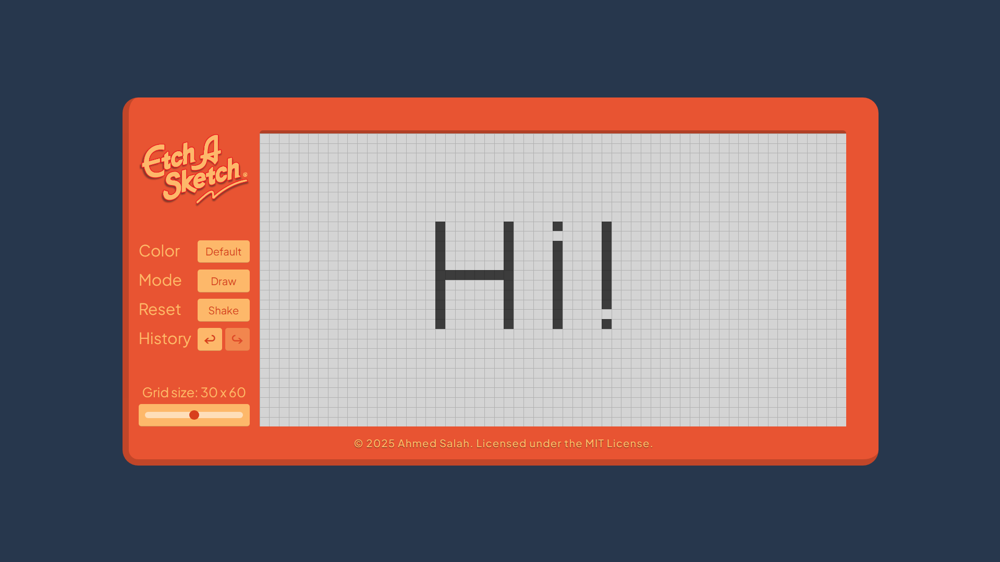

# Etch A Sketch

A modern web-based drawing application inspired by the classic Etch-A-Sketch toy. Create pixel art with various drawing modes, custom colors, and undo/redo functionality.



[](https://html.spec.whatwg.org/)
[](https://www.w3.org/Style/CSS/)
[](https://262.ecma-international.org//)

## Demo

[Live Preview](https://ahmedcodespace.github.io/etch-a-sketch/)

## Features

- **Multiple Drawing Modes:**

  - Default: Classic black drawing
  - Tint: Progressive shading
  - 70s: Colorful retro palette
  - Color Picker: Custom color selection

- **Interactive Controls:**

  - Adjustable grid size (10x20 to 50x100)
  - Undo/Redo functionality (Ctrl+Z, Ctrl+Shift+Z)
  - Shake to erase
  - Draw/Erase modes

- **Responsive Design:**
  - Clean, modern interface
  - Smooth animations
  - Interactive hover effects

## How to Use

1. **Drawing:**

   - Click and drag on the grid to draw
   - Use the Mode selector to switch between Draw/Erase
   - Click the Color selector to cycle through color modes

2. **Grid Size:**

   - Use the slider to adjust the grid dimensions
   - Grid size ranges from 10x20 to 50x100

3. **Colors:**

   - Default: Classic dark gray drawing
   - Tint: Progressive grayscale shading
   - 70s: Cycle through retro colors
   - Picker: Choose custom colors

4. **History:**

   - Click the undo/redo buttons or use keyboard shortcuts
   - Ctrl+Z: Undo
   - Ctrl+Shift+Z: Redo

5. **Reset:**
   - Click the "Shake" button to clear the canvas
   - Includes a satisfying shake animation!

## Installation

1. Clone the repository:

   ```bash
   git clone https://github.com/AhmedCodespace/etch-a-sketch.git
   ```

2. Open `index.html` in your web browser

## Contribution

To modify or enhance the application:

1. Fork the repository
2. Create a new branch for your feature
3. Make your changes
4. Submit a pull request

## License

This project is licensed under the MIT License - see the [LICENSE](LICENSE) file for details.

## Author

**Ahmed Salah**  
GitHub: [AhmedCodespace](https://github.com/AhmedCodespace)

## Acknowledgments

- The Odin Project for the project inspiration
- The open-source community for various resources and inspiration
